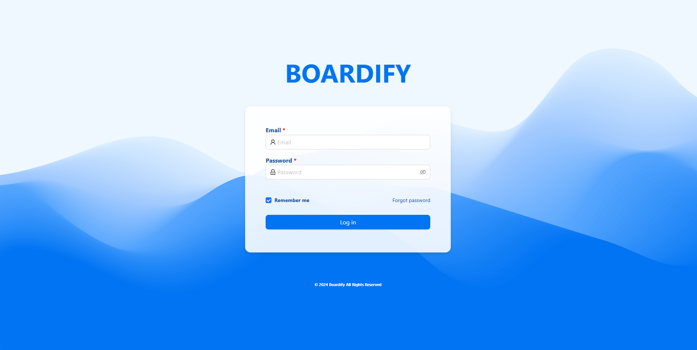

# BOARDIFY




## How to run 🛠️

 * ``` git clone https://github.com/AmbroiseM/BOARDIFY.git ```

 * ``` docker-compose up --build ```

Open a new terminal and enter : 

1) ``` docker-compose exec db psql -U postgres -d postgres ```
2) ``` \c my_kanboard  ```
3) ``` INSERT INTO "user" (email, password, "firstName", "lastName", role) VALUES ('admin@boardify.fr', 'password', 'admin', 'admin', 'DIRECTOR'); ```
4) ``` insert into "public"."project" ("description", "managerId", "name") values ('Description', 1, 'Boardify'); ```
5) ``` UPDATE "user" SET project_id = 1 WHERE email = 'admin@boardify.fr'; ```
6) For "admin@boardify.fr", you can enter any password to log in

And you should be good to go 🚀 

## 🤝 Contribution
If anyone comes across this repo and sees something that can be improved in the code, please feel free to open a pull request or open an issue 😊

##  Disclaimer

I'm not a front-end expert/ UI-UX designer grand master, i do what i can 😂

 
